# Jarkom-Modul-2-F06-2022

## Kelompok F06

|               Nama               |      NRP      |
| -------------------------------- | ------------- |
| Benedictus Bimo Cahyo Wicaksono  |  5025201097   |  
| Andhika Ditya Bagaskara D.       |  5025201096   |
| Theresia Nawangsih               |  5025201144   |

# Soal 1
### WISE akan dijadikan sebagai DNS Master, Berlint akan dijadikan DNS Slave, dan Eden akan digunakan sebagai Web Server. Terdapat 2 Client yaitu SSS, dan Garden. Semua node terhubung pada router Ostania, sehingga dapat mengakses internet.

Digunakan OSTANIA sebagai router network configuration, OSTANIA CONFIG:
```
auto eth0
iface eth0 inet dhcp

auto eth1
iface eth1 inet static
	address 192.202.1.1
	netmask 255.255.255.0

auto eth2
iface eth2 inet static
	address 192.202.2.1
	netmask 255.255.255.0

auto eth3
iface eth3 inet static
	address 192.202.3.1
	netmask 255.255.255.0
```

Kemudian setup iptables
```
iptables -t nat -A POSTROUTING -o eth0 -j MASQUERADE -s 192.202.0.0/16
cat /etc/resolv.conf
```
<p align="center">
  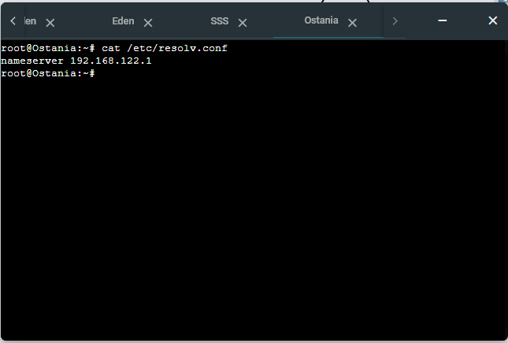
</p><br>

SSS sebagai client, SSS CONFIG:
```
auto eth0
iface eth0 inet static
	address 192.202.1.2
	netmask 255.255.255.0
	gateway 192.202.1.1
```

Garden sebagai client, Garden CONFIG:
```
auto eth0
iface eth0 inet static
	address 192.202.1.3
	netmask 255.255.255.0
	gateway 192.202.1.1
```

Berlint sebagai DNS slave network configuration, Berlint CONFIG:
```
auto eth0
iface eth0 inet static
	address 192.202.2.2
	netmask 255.255.255.0
	gateway 192.202.2.1
```

Eden sebagai web server network configuration, Eden CONFIG:
```
auto eth0
iface eth0 inet static
	address 192.202.2.3
	netmask 255.255.255.0
	gateway 192.202.2.1
```

WISE sebagai DNS master network configuration, WISE CONFIG:
```
# Static config for eth0
auto eth0
iface eth0 inet static
	address 192.202.3.2
	netmask 255.255.255.0
	gateway 192.202.3.1
```

ALL
```bash
echo nameserver 192.168.122.1 > /etc/resolv.conf
ping google.com
```
<p align="center">
  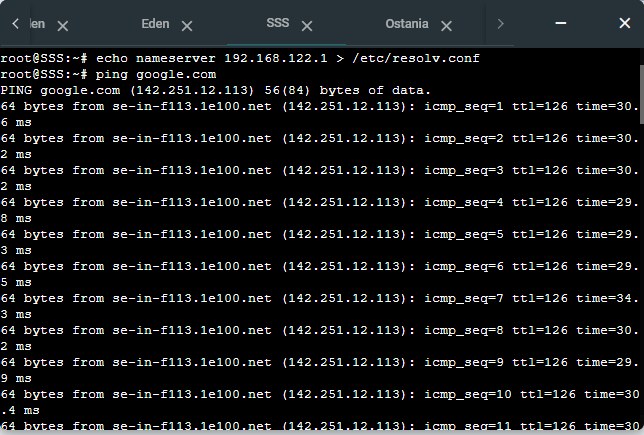
</p><br>

# Soal 2
### Untuk mempermudah mendapatkan informasi mengenai misi dari Handler, bantulah Loid membuat website utama dengan akses wise.yyy.com dengan alias www.wise.yyy.com pada folder wise.

Install bind9 pada WISE & BERLINT
```bash
apt-get update
apt-get install bind9 -y
```

Pada WISE, jalankan perintah berikut
```bash
nano /etc/bind/named.conf.local :
zone "wise.f06.com" {
    type master;
    file "/etc/bind/wise/wise.f06.com";
};
```
Buat folder `/etc/bind/wise` dan copy isi dari file `/etc/bind/db.local/` ke `/etc/bind/wise/wise.f06.com`
```bash
mkdir /etc/bind/wise
cp /etc/bind/db.local /etc/bind/wise/wise.f06.com
```
Jalankan perintah nano dan isikan file `wise.f06.com` dengan configuration sebagai berikut
```bash
nano /etc/bind/wise/wise.f06.com
```
```
;
; BIND data file for local loopback interface
;
$TTL    604800
@       IN      SOA     wise.f06.com. root.wise.f06.com. (
                              2         ; Serial
                         604800         ; Refresh
                          86400         ; Retry
                        2419200         ; Expire
                         604800 )       ; Negative Cache TTL
;
@       IN      NS      wise.f06.com.
@       IN      A       192.202.3.2     ; IP WISE
www     IN      CNAME   wise.f06.com.
@       IN      AAAA    ::1
```
<p align="center">
  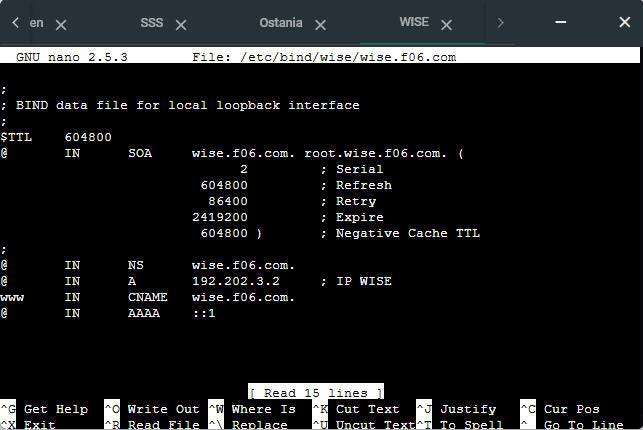
</p><br>
Setelah mengubah konfigurasi, lakukan restart bind9
```bash
service bind9 restart
```
Jalankan perintah berikut di client SSS & Garden
```bash
nano /etc/resolv.conf
```
```
nameserver 192.202.3.2
```
<p align="center">
  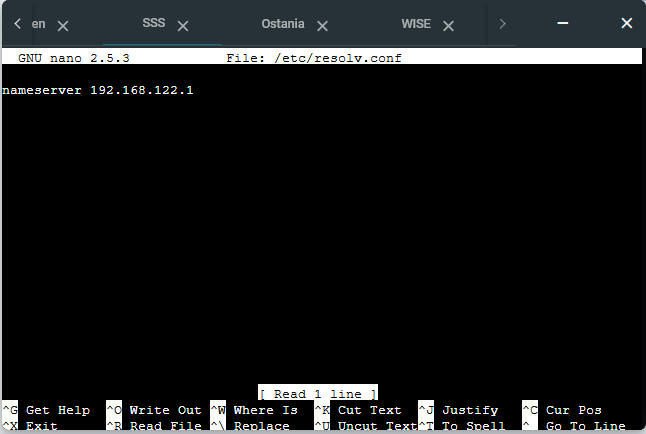
</p><br>

# Soal 3
### Setelah itu ia juga ingin membuat subdomain eden.wise.yyy.com dengan alias www.eden.wise.yyy.com yang diatur DNS-nya di WISE dan mengarah ke Eden.

Jalankan perintah untuk mengubah isi dari file `wise.f06.com` dan masukkan konfigurasi sebagai berikut di WISE
```bash
nano /etc/bind/wise/wise.f06.com
```
```
;
; BIND data file for local loopback interface
;
$TTL    604800
@       IN      SOA     wise.f06.com. root.wise.f06.com. (
                              2         ; Serial
                         604800         ; Refresh
                          86400         ; Retry
                        2419200         ; Expire
                         604800 )       ; Negative Cache TTL
;
@               IN      NS      wise.f06.com.
@               IN      A       192.202.2.3     ; IP Eden
www             IN      CNAME   wise.f06.com.
eden            IN      A       192.202.2.3     ; IP Eden
www.eden        IN      CNAME   eden.wise.f06.com.
@               IN      AAAA    ::1
```
<p align="center">
  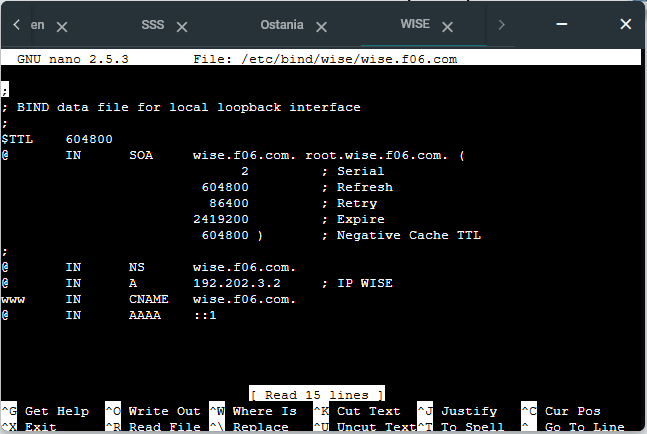
</p><br>
Lakukan restart bind9

```bash
service restart bind9
```

# Soal 4
### Buat juga reverse domain untuk domain utama.

Pada terminal WISE, jalankan perintah sebagai berikut
```bash
nano /etc/bind/named.conf.local
```
```
zone "wise.f06.com" {
    type master;
    file "/etc/bind/wise/wise.f06.com";
};

zone "2.202.192.in-addr.arpa" {
    type master;
    file "/etc/bind/wise/2.202.192.in-addr.arpa";
};
```
<p align="center">
  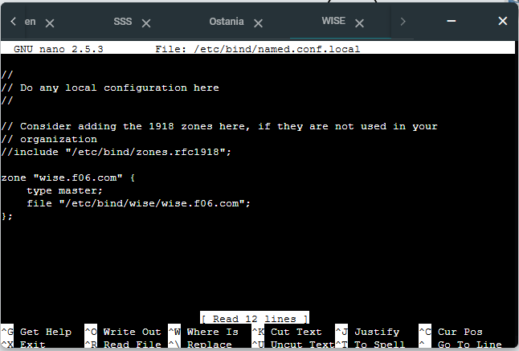
</p><br>

Kemudian jalankan perintah untuk mengubah isi file `2.202.192.in-addr.arpa`
```bash
cp /etc/bind/db.local /etc/bind/wise/3.202.192.in-addr.arpa
nano /etc/bind/wise/2.202.192.in-addr.arpa
```
```bash
;
; BIND data file for local loopback interface
;
$TTL    604800
@       IN      SOA     wise.f06.com. root.wise.f06.com. (
                              2         ; Serial
                         604800         ; Refresh
                          86400         ; Retry
                        2419200         ; Expire
                         604800 )       ; Negative Cache TTL
;
2.202.192.in-addr.arpa. IN      NS      wise.f06.com.
3                       IN      PTR     wise.f06.com.
```
<p align="center">
  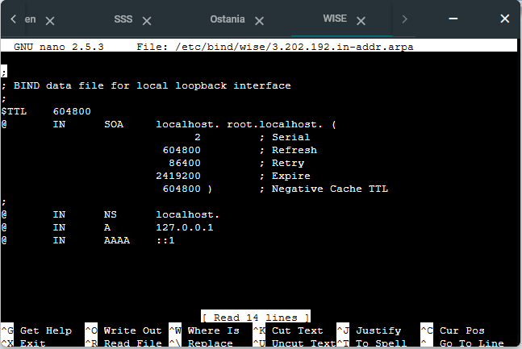
</p><br>

Lakukan restart bind9
```bash
service bind9 restart
```
Pada client, lakukan instalasi dnsutils
```bash
apt-get update
apt-get install dnsutils
```
Kemudian jalankan perintah sebagai berikut
```bash
host -t PTR 192.202.2.2
```

# Soal 5
### Agar dapat tetap dihubungi jika server WISE bermasalah, buatlah juga Berlint sebagai DNS Slave untuk domain utama.

Jalankan perintah berikut di WISE untuk mengubah isi `named.conf.local`
```bash
nano /etc/bind/named.conf.local
```
```
zone "wise.f06.com" {
    type master;
    notify yes;
    also-notify { 192.202.2.2; }; // IP Berlint
    allow-transfer { 192.202.2.2; }; // IP Berlint
    file "/etc/bind/wise/wise.f06.com";
};
```
<p align="center">
  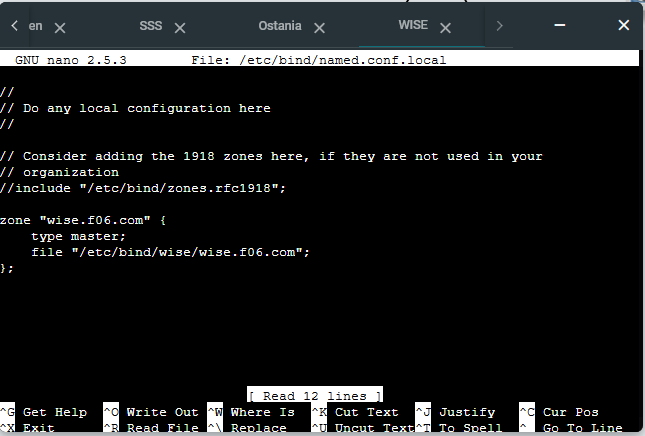
</p><br>

Lakukan restart bind9
```bash
service bind9 restart
```

Pada Berlint, ubah isi file `named.conf.local`
```bash
nano /etc/bind/named.conf.local
```
```
zone "wise.f06.com" {
    type slave;
    masters { 192.202.3.2; };
    file "/var/lib/bind/wise.f06.com";
};
```
<p align="center">
  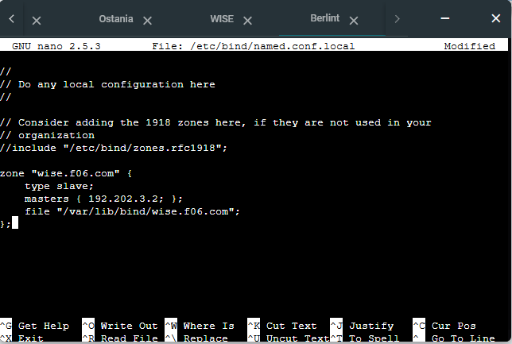
</p><br>

Lakukan restart bind9
```bash
service bind9 restart
```

Hentikan bind9 pada WISE
```bash
service bind9 stop
```

Jalankan perintah berikut pada CLIENT
```bash
nano /etc/resolv.conf
```
```
nameserver 192.202.3.2
nameserver 192.202.2.2
```
Kemudian lakukan ping pada `wise.f06.com`
```bash
ping wise.f06.com
```
<p align="center">
  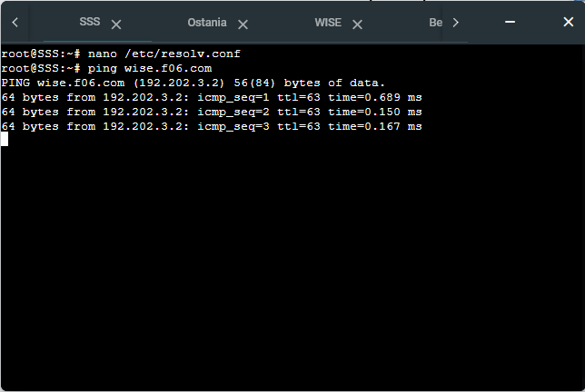
</p><br>

# Soal 6
### Karena banyak informasi dari Handler, buatlah subdomain yang khusus untuk operation yaitu operation.wise.yyy.com dengan alias www.operation.wise.yyy.com yang didelegasikan dari WISE ke Berlint dengan IP menuju ke Eden dalam folder operation.

Pada terminal WISE, isikan `wise.f06.com` dengan konfigurasi sebagai berikut
```bash
nano /etc/bind/wise/wise.f06.com
```
```
;
; BIND data file for local loopback interface
;
$TTL    604800
@       IN      SOA     wise.f06.com. root.wise.f06.com. (
                              2         ; Serial
                         604800         ; Refresh
                          86400         ; Retry
                        2419200         ; Expire
                         604800 )       ; Negative Cache TTL
;
@               IN      NS      wise.f06.com.
@               IN      A       192.202.2.2     ; IP WISE
www             IN      CNAME   wise.f06.com.
eden            IN      A       192.202.2.3     ; IP Eden
www.eden        IN      CNAME   eden.wise.f06.com.
ns1             IN      A       192.202.2.2     ; IP Berlint
operation       IN      NS      ns1
@               IN      AAAA    ::1
```
<p align="center">
  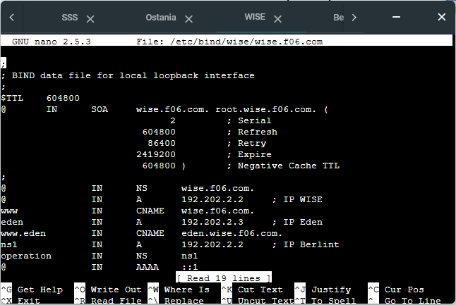
</p><br>

Kemudian jalankan perintah berikut
```bash
nano /etc/bind/named.conf.options
```
```bash
allow-query{any;};
```

Lakukan penambahan: FORWARDERS -> WISE dan jalankan perintah 
```bash
nano /etc/bind/named.conf.options
```
```
forwarders {
    192.168.122.1;
};
```
<p align="center">
  
</p><br>

Lakukan restart bind9
```bash
service bind9 restart
```

Pada terminal Berlint, jalankan perintah sebagai berikut
```bash
nano /etc/bind/named.conf.options
```
```
allow-query{any;};
```
```bash
nano /etc/bind/named.conf.local
```
```
zone "operation.wise.f06.com" {
    type master;
    file "/etc/bind/operation/operation.wise.f06.com";
};
```
<p align="center">
  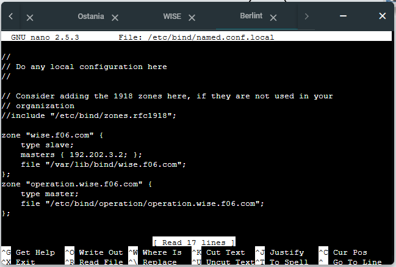
</p><br>

Kemudian buat folder `/etc/bind/operation` dan lakukan pembuatan file `operation.wise.f06.com` dan isikan konfigurasi sebagai berikut
```bash
mkdir /etc/bind/operation 
nano /etc/bind/operation/operation.wise.f06.com
```
```
;
; BIND data file for local loopback interface
;
$TTL    604800
@       IN      SOA     operation.wise.f06.com. root.operation.wise.f06.com. (
                              2         ; Serial
                         604800         ; Refresh
                          86400         ; Retry
                        2419200         ; Expire
                         604800 )       ; Negative Cache TTL
;
@       IN      NS      operation.wise.f06.com.
@       IN      A       192.202.2.3     ; IP Eden
www     IN      CNAME   operation.wise.f06.com.
```
<p align="center">
  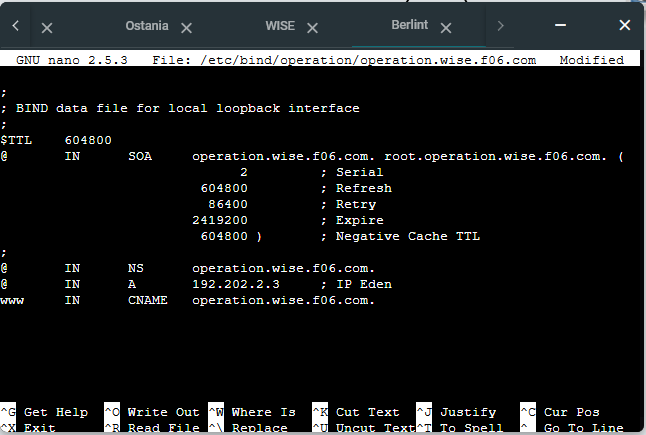
</p><br>

Lakukan restart bind9
```bash
service bind9 restart
```

# Soal 7
### Untuk informasi yang lebih spesifik mengenai Operation Strix, buatlah subdomain melalui Berlint dengan akses strix.operation.wise.yyy.com dengan alias www.strix.operation.wise.yyy.com yang mengarah ke Eden.

Pada terminal Berlint, tambahkan konfigurasi pada `operation.wise.f06.com`
```bash
nano /etc/bind/operation/operation.wise.f06.com
```
```
;
; BIND data file for local loopback interface
;
$TTL    604800
@       IN      SOA     operation.wise.f06.com. root.operation.wise.f06.com. (
                              2         ; Serial
                         604800         ; Refresh
                          86400         ; Retry
                        2419200         ; Expire
                         604800 )       ; Negative Cache TTL
;
@               IN      NS      operation.wise.f06.com.
@               IN      A       192.202.2.3     ; IP Eden
www             IN      CNAME   operation.wise.f06.com.
strix           IN      A       192.202.2.3     ; IP Eden
www.strix       IN      CNAME   strix.operation.wise.f06.com.
```
<p align="center">
  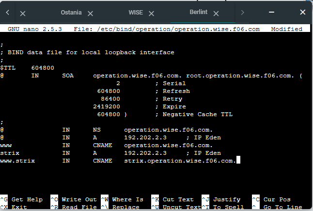
</p><br>

# Soal 8
### Setelah melakukan konfigurasi server, maka dilakukan konfigurasi Webserver. Pertama dengan webserver www.wise.yyy.com. Pertama, Loid membutuhkan webserver dengan DocumentRoot pada /var/www/wise.yyy.com.

Pada client, lakukan instalasi `lynx`
```bash
apt-get update
apt-get install lynx
```

Pada server Eden, lakukan instalasi `apache2`, `php`, dan juga `libapache2-mod-php7.0`
```bash
apt-get update
apt-get install apache2
service apache2 start
apt-get install php
apt-get install libapache2-mod-php7.0
```

Buat folder di `/var/www/wise.f06.com` dan copy file `000-default.conf` sebagai `wise.f06.com.conf` dengan perintah berikut. Kemudian sesuaikan konfigurasi pada `wise.f06.com.conf`
```bash
mkdir /var/www/wise.f06.com
cp /etc/apache2/sites-available/000-default.conf /etc/apache2/sites-available/wise.f06.com.conf
nano /etc/apache2/sites-available/wise.f06.com.conf
```
<p align="center">
  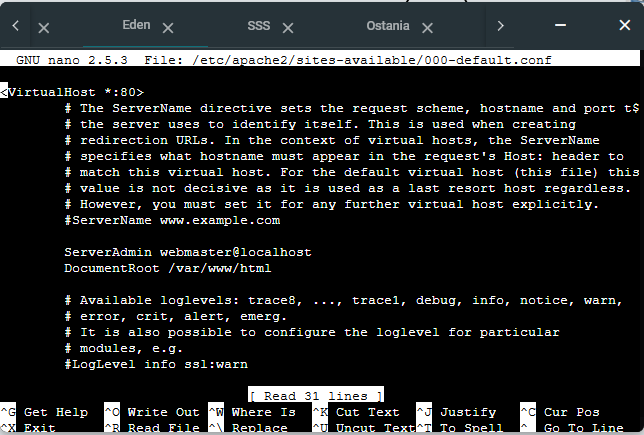
</p><br>

```
ServerAdmin webmaster@localhost
DocumentRoot /var/www/wise.f06.com
ServerName wise.f06.com
ServerAlias www.wise.f06.com
```
<p align="center">
  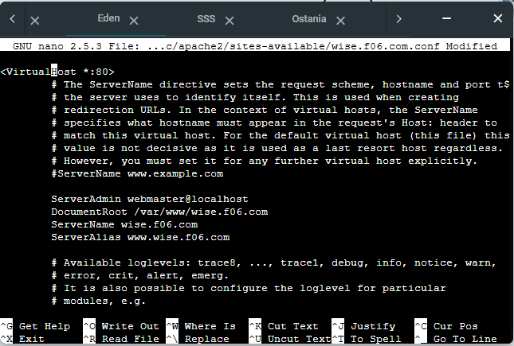
</p><br>

Hentikan `000-default.conf` dan jalankan `wise.f06.com`
```bash
a2dissite 000-default.conf
a2ensite wise.f06.com.conf
```
Download file .zip yang diperlukan dan lakukan unzip serta copy hasil dari unzip `wise.zip` kedalam `/var/www/wise.f06.com`. Kemudian lakukan restart apache2
```bash
wget https://raw.github.com/theresianwg/pratikum-jarkom-modul-2/main/eden.wise.zip
wget https://raw.github.com/theresianwg/pratikum-jarkom-modul-2/main/strix.operation.wise.zip
wget https://raw.github.com/theresianwg/pratikum-jarkom-modul-2/main/wise.zip

unzip ~/wise.zip
cp -r ~/wise/. /var/www/wise.f06.com/
service apache2 restart
```

Pada terminal client, buka `wise.f06.com` dengan `lynx`
```bash
lynx wise.f06.com
```
<p align="center">
  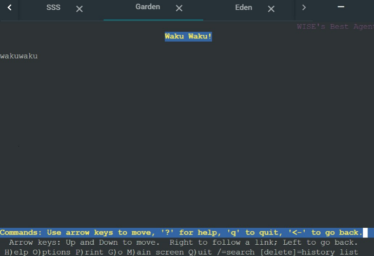
</p><br>

# Soal 9
### Setelah itu, Loid juga membutuhkan agar url www.wise.yyy.com/index.php/home dapat menjadi menjadi www.wise.yyy.com/home.

Pada terminal Eden, jalankan perintah untuk rewrite dan lakukan restart apache2
```bash
a2enmod rewrite
service apache2 restart
```
Kemudian tambahkan konfigurasi berikut kedalam `/var/www/wise.f06.com/.htaccess`
```
nano /var/www/wise.f06.com/.htaccess :
RewriteEngine On
RewriteRule ^home index.php/home
```
Tambahkan konfigurasi berikut berikut juga kedalam `/etc/apache2/sites-available/wise.f06.com.conf`
```
nano /etc/apache2/sites-available/wise.f06.com.conf :
<Directory /var/www/wise.f06.com>
    Options +FollowSymLinks -Multiviews
    AllowOverride All
</Directory>
```
Lakukan restart apache2
```
service apache2 restart
```

Pada Client, buka `wise.f06.com/home` dengan `lynx`
```
lynx wise.f06.com/home
```

# Soal 10
### Setelah itu, pada subdomain `www.eden.wise.yyy.com` , Loid membutuhkan penyimpanan aset yang memiliki DocumentRoot pada `/var/www/eden.wise.yyy.com`

Pertama pada Server Eden, mengkonfigurasi file menggunakan 
```
cp /etc/apache2/sites-available/000-default.conf /etc/apache2/sites-available/eden.wise.f06.com.conf
nano /etc/apache2/sites-available/eden.wise.f06.com.conf
```
dan juga
```
ServerAdmin webmaster@localhost
DocumentRoot /var/www/eden.wise.f06.com
ServerName eden.wise.f06.com
ServerAlias www.eden.wise.f06.com
```
lalu membuat documentroot pada `/var/www/eden.wise.f06.com` , dilanjutkan mengaktifkan virtualhost menggunakan a2ensite
```
a2ensite eden.wise.f06.com.conf
service apache2 reload
```
melakukan copy content ke documentroot menggunakan 
```
unzip ~/eden.wise.zip
cp ~/eden.wise/. /var/www/eden.wise.f06.com/
service apache2 restart
```
### Testing 
Pada client yaitu SSS atau Garden kita dapat melakukan testing menggunakan ```lynx eden.wise.f06.com```
<p align="center">
  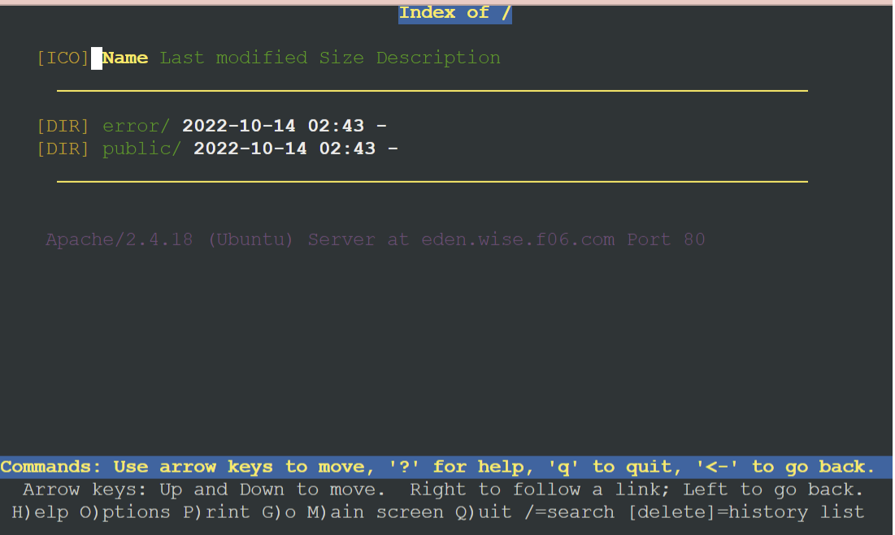
</p><br>


# Soal 11
### Akan tetapi, pada folder `/public`, Loid ingin hanya dapat melakukan directory listing saja

Pertama pada Server Eden, mengkonfigurasi file dapat menggunakan `nano /etc/apache2/sites-available/eden.wise.f06.com.conf`
Selanjutnya, menambahkan Options + Indeks pada direktori yang ingin di list
```
<Directory /var/www/eden.wise.f06.com/public>
    Options +Indexes
</Directory>
```
Lalu melakukan `service apache2 restart`

### Testing 
Pada client yaitu SSS atau Garden kita dapat melakukan testing menggunakan `lynx eden.wise.f06.com/public`
<p align="center">
  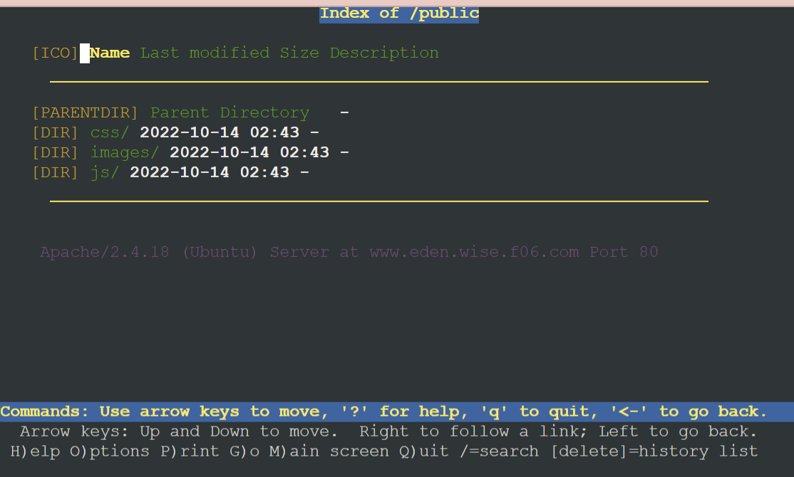
</p><br>

# Soal 12
### Tidak hanya itu, Loid juga ingin menyiapkan error file 404.html pada folder `/error` untuk mengganti error kode pada apache 

Pertama pada Server Eden, mengkonfigurasi file dapat menggunakan `nano /etc/apache2/sites-available/eden.wise.f06.com.conf`
Dilanjutkan, dengan menambahkan konfigurasi `ErrorDocument` pada setiap error yang mengarah pada file `/error/404.html`
```
<Directory /var/www/eden.wise.f06.com>
    ErrorDocument 404 /error/404.html
</Directory>
```
Lalu melakukan `service apache2 restart`

### Testing 
Pada client yaitu SSS atau Garden kita dapat melakukan testing menggunakan `lynx eden.wise.f06.com/test`
<p align="center">
  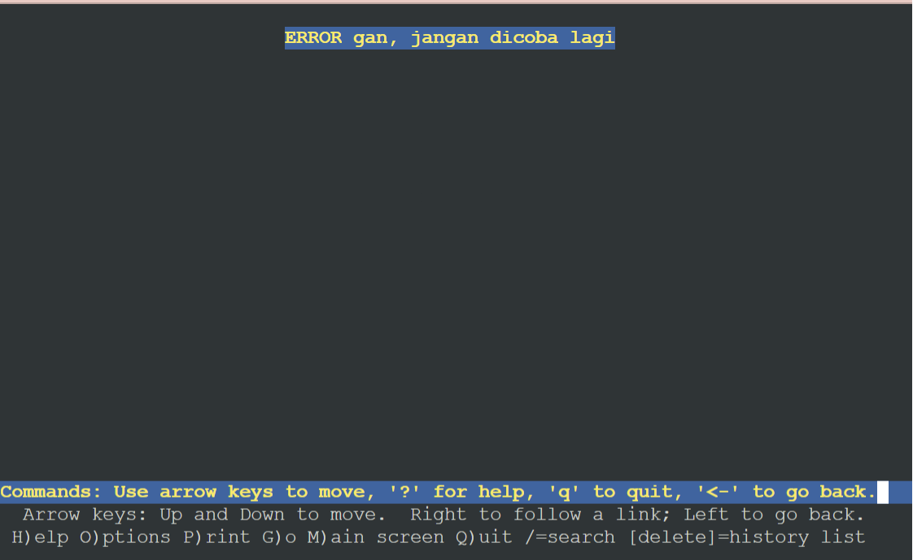
</p><br>

# Soal 13
### Loid juga meminta Franky untuk dibuatkan konfigurasi virtual host. Virtual host ini bertujuan untuk dapat mengakses file asset `www.eden.wise.yyy.com/public/js` menjadi `www.eden.wise.yyy.com/js`

Pertama pada Server Eden, mengkonfigurasi file dapat menggunakan `nano /etc/apache2/sites-available/eden.wise.f06.com.conf`
Lalu untuk menambahkan konfigurasi Alias, menggunakan
```
Alias "/js" "/var/www/eden.wise.f06.com/public/js"
```
Lalu melakukan `service apache2 restart`

### Testing 
Pada client yaitu SSS atau Garden kita dapat melakukan testing menggunakan `lynx eden.wise.f06.com/js`
<p align="center">
  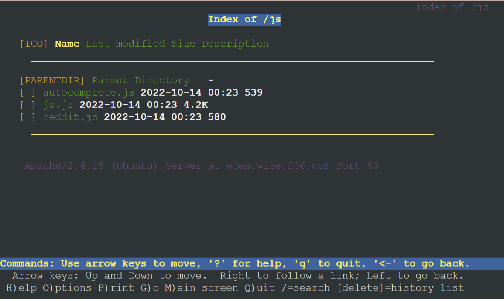
</p><br>

# Soal 14
### Loid meminta agar www.strix.operation.wise.yyy.com hanya bisa diakses dengan port `15000` dan port `15500` 

Pertama pada Server Eden, mengkonfigurasi file menggunakan
```
cp /etc/apache2/sites-available/000-default.conf /etc/apache2/sites-available/strix.operation.wise.f06.com.conf
nano /etc/apache2/sites-available/strix.operation.wise.f06.com.conf
```
lalu menambahkan VirtualHost baru pada port `15000` dan port `15500` 
```
<VirtualHost *:15000 *:15500>
        ServerAdmin webmaster@localhost
        DocumentRoot /var/www/strix.operation.wise.f06.com
        ServerName strix.operation.wise.f06.com
        ServerAlias www.strix.operation.eden.wise.f06.com

	ErrorLog ${APACHE_LOG_DIR}/error.log
        CustomLog ${APACHE_LOG_DIR}/access.log combined
</VirtualHost>
```
Dilanjutkan, mengkonfigurasi file menggunakan `nano /etc/apache2/ports.conf `untuk menambahkan listen port `15000` dan port `15500` 
```
Listen 1500
Listen 15500
```
selanjutnya melakukan
```
a2ensite strix.operation.wise.f06.com.conf
service apache2 reload
```
lalu melakukan uznip, menggunakan
```
unzip ~/strix.operation.wise.zip
cp -r ~/strix.operation.wise/. /var/www/strix.operation.wise.f06.com/
```
dan `service apache2 restart`

### Testing 
Pada client yaitu SSS atau Garden kita dapat melakukan testing menggunakan
```
lynx strix.operation.wise.f06.com:15000
lynx strix.operation.wise.f06.com:15500
```

# Soal 15
###  Dengan autentikasi username Twilight dan password opStrix dan file di `/var/www/strix.operation.wise.yyy`

Pertama pada Server Eden, menjalankan command `htpasswd -nb Twilight opStrix > /etc/apache2/.htpasswd`
lalu, mengkonfiogurasi file dengan `nano /etc/apache2/sites-available/strix.operation.wise.f06.com.conf`. 
Dan juga pada `/var/www/strix.operation.wise.f06.com`
```
<Directory /var/www/strix.operation.wise.f06.com>
    AuthType Basic
    AuthName "Restricted Files"
    AuthUserFile /etc/apache2/.htpasswd
    Require valid-user
</Directory>
```
Lalu melakukan `service apache2 restart`

### Testing 
Pada client yaitu SSS atau Garden kita dapat melakukan testing menggunakan `lynx strix.operation.wise.f06.com:15000`

# Soal 16
### Dan setiap kali mengakses IP Eden akan dialihkan secara otomatis ke `www.wise.yyy.com`

Pertama pada Server Eden, mengkonfigurasi file menggunakan `nano /var/www/html/.htaccess` lalu, dapat menambahkan
```
RewriteEngine On
RewriteBase /
RewriteCond %{HTTP_HOST} ^192\.202\.2\.3$
RewriteRule ^(.*)$ http://wise.f06.com/$1 [L,R=301]
```
Dilanjutkan dengan `nano /etc/apache2/sites-available/000-default.conf` dan menambahkan
```
<Directory /var/www/html>
    Options +FollowSymLinks -Multiviews
    AllowOverride All
</Directory>
```
Lalu melakukan `service apache2 restart`

### Testing 
Pada client yaitu SSS atau Garden kita dapat melakukan testing menggunakan `lynx 192.202.2.3`
<p align="center">
  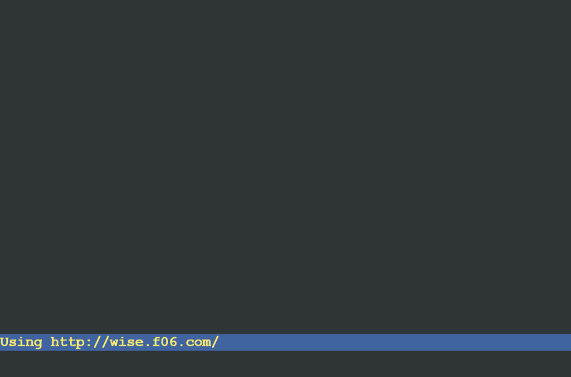
</p><br>
<p align="center">
  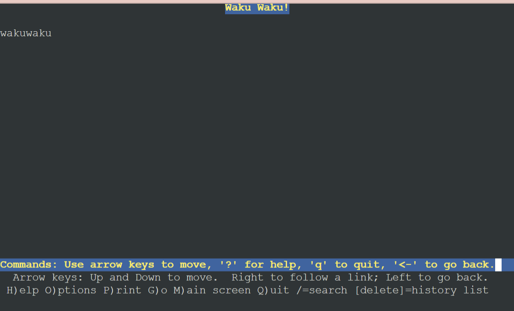
</p><br>


# Soal 17
### Karena website `www.eden.wise.yyy.com` semakin banyak pengunjung dan banyak modifikasi sehingga banyak gambar-gambar yang random, maka Loid ingin mengubah request gambar yang memiliki substring “eden” akan diarahkan menuju eden.png. Bantulah Agent Twilight dan Organisasi WISE menjaga perdamaian! 

Pertama pada Server Eden, mengkonfigurasi dengan `nano /var/www/eden.wise.f06.com/public/images/.htaccess`, lalu menambahkan
```
RewriteEngine On
RewriteCond %{REQUEST_URI} ^/public/images/(.*)eden(.*)
RewriteRule eden http://eden.wise.f06.com/public/images/eden.png$1 [L,R=301]
```
Selanjutnya, mengkonfigurasi file menggunakan `nano /etc/apache2/sites-available/eden.wise.f06.com.conf` dan
```<Directory /var/www/eden.wise.f06.com/public/images>
    Options +FollowSymLinks -Multiviews +Indexes
    AllowOverride All
</Directory>
```
Lalu melakukan `service apache2 restart`

### Testing 
Pada client yaitu SSS atau Garden kita dapat melakukan testing menggunakan `lynx www.eden.wise.f06.com/public/images/eden-student.png`

